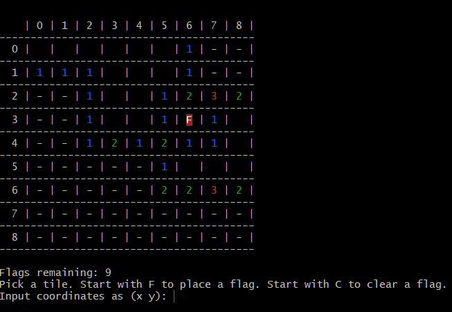
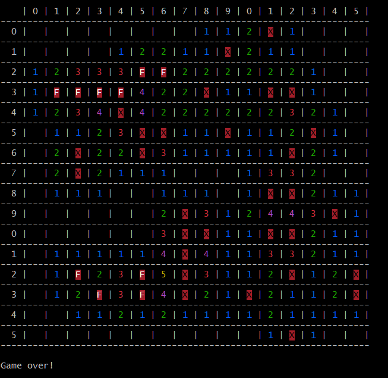
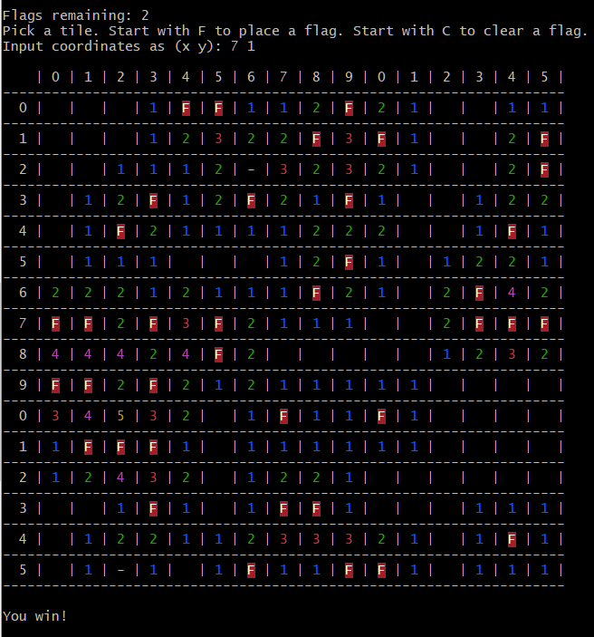

# Minesweeper

A simple minesweeper clone.

Currently only runs from the command line but my goal is to make a reusable engine that can be played with different frontends.

This project is mostly for my own fun, to practice my coding skills, and to experiment with different UIs. If you want to use it for your own use you are welcome as long as you follow the rules of the license.

### Platforms

This program has been tested and works on Linux and Windows 10.

In order to get the color printing to work in the Windows CMD (Windows 10 only) you will need to do the following:

1. Run PowerShell or CMD as administrator

2. Add the following register key:

`reg add HKEY_CURRENT_USER\Console /v VirtualTerminalLevel /t REG_DWORD /d 0x00000001 /f`

### Screenshots

## Planned updates

* More user-friendly input method.

* Any kind of GUI.
