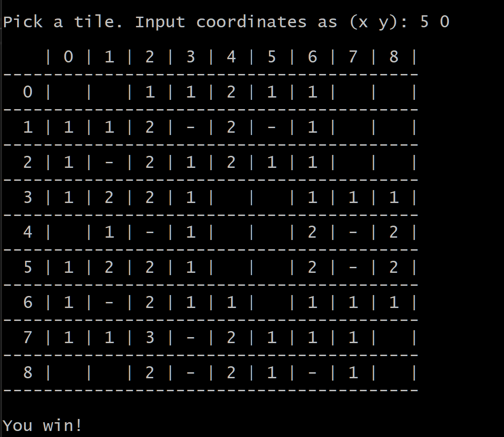

# Minesweeper

A simple minesweeper clone.

Currently only runs from the command line but my goal is to make a reusable engine that can be played with different frontends.

This project is mostly for my own fun, to practice my coding skills, and to experiment with different UIs. If you want to use it for your own use you are welcome as long as you follow the rules of the license.

## Planned updates

* More user-friendly input method.

* More robust input handling (right now the console freaks out if you give it the wrong input).

* Selectable difficult (currently only Beginner mode is available).

* Color coding minefield nubmers.

* Any kind of GUI.
